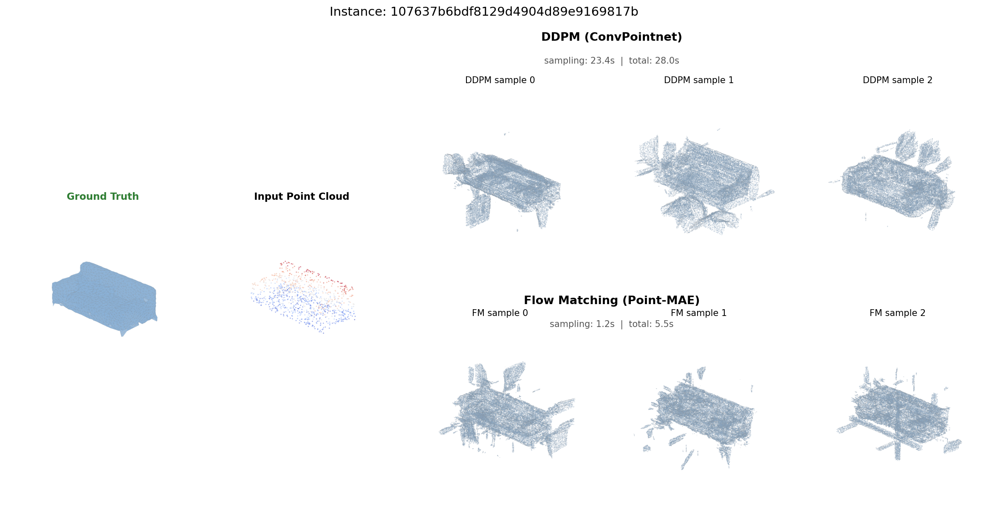
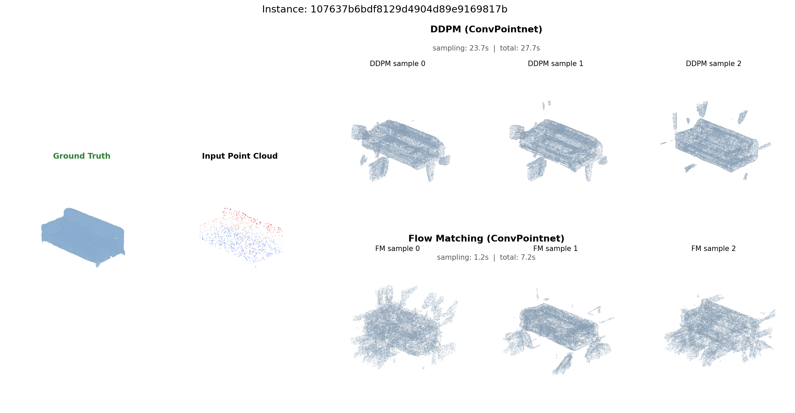
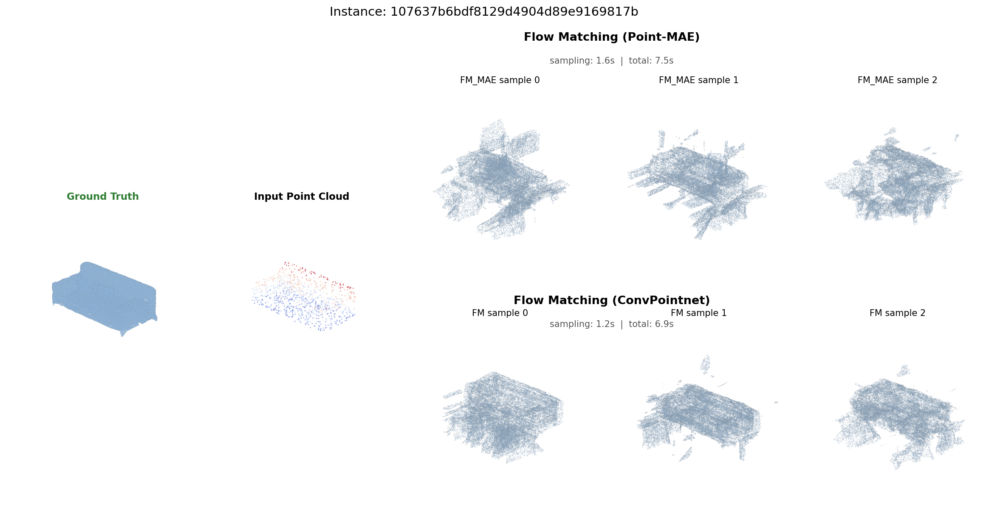
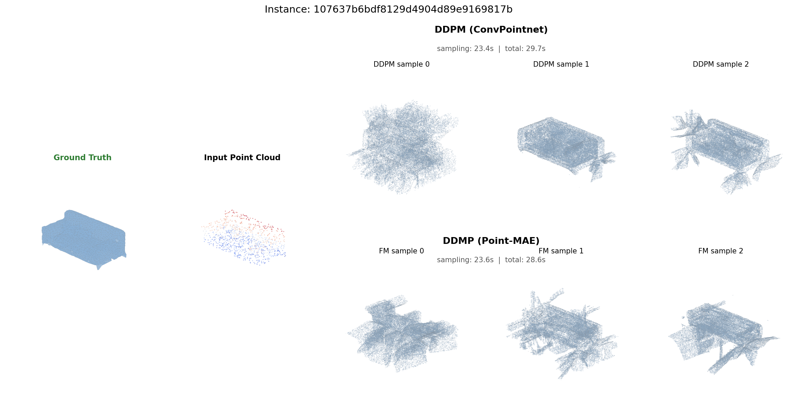
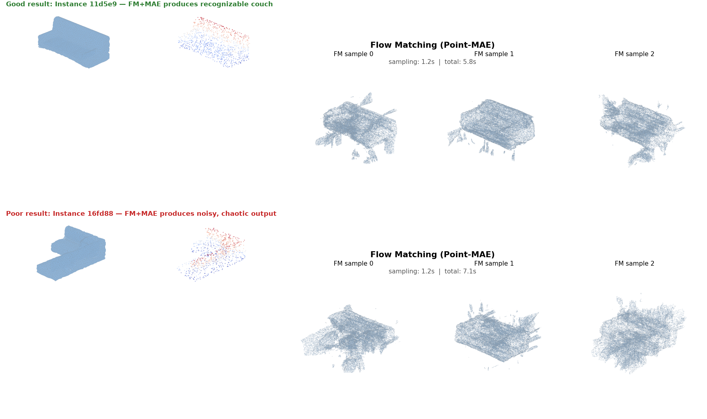

# Experimental Results: Flow Matching and Point-MAE for Diffusion-SDF

**Authors:** Viswa Subramanian, Yao-Ting Huang, Minh Bao Quach

**Continuation of:** ECE 285 Midterm Report

---

## 1. Overview

This report documents the full experimental progression from initial pipeline validation through systematic ablation studies. We evaluate two proposed modifications to Diffusion-SDF [1]:

1. **Replacing DDPM with Conditional Flow Matching (CFM)** — for faster inference
2. **Replacing ConvPointnet with Point-MAE** — for richer point cloud conditioning

All experiments were run on a single NVIDIA RTX A6000 GPU (48GB VRAM) using the ACRONYM/ShapeNet Couch dataset (173 instances). The three training stages are:

- **Stage 1 (SDF-VAE):** Learns per-shape modulation vectors. Shared across all experiments.
- **Stage 2 (Diffusion-only):** Trains the generative model (DDPM or FM) to produce modulation vectors conditioned on partial point clouds.
- **Stage 3 (End-to-end):** Fine-tunes the full pipeline jointly (SDF decoder + VAE + generative model).

---

## 2. Experiment Timeline

| # | Experiment | Models Trained | S2 Epochs | S3 Epochs | Duration | Key Question |
|---|-----------|----------------|-----------|-----------|----------|--------------|
| 1 | Baseline | DDPM+Conv, FM+MAE | 5,000 | 1,500 | 14h 23m | Does FM+MAE work at all? |
| 2 | FM Hyperparameter Tuning | FM+Conv, DDPM+Conv | 5,000 | 5,000 | 27h 24m | Can higher LR fix FM? Is Point-MAE the problem? |
| 3 | FM Extended Training | FM+MAE, FM+Conv | — | 5K→10K | 30h | Does more training help FM? |
| 4 | Point-MAE Encoder Ablation | DDPM+MAE | 5,000 | 5,000 | 17h 46m | Does Point-MAE work with DDPM? |

All experiments used a shared Stage 1 SDF-VAE checkpoint (10,500 epochs). Total GPU-hours invested: ~90 hours across all experiments.

---

## 3. Experiment Details and Results

### 3.1 Experiment 1: Baseline

**Goal:** Validate the full pipeline end-to-end, then train long enough to produce a first real quality comparison between DDPM and FM.

**Models trained:**
- **DDPM+ConvPointnet** — original Diffusion-SDF architecture (60.3M params)
- **FM+Point-MAE** — both proposed modifications applied simultaneously (79.8M params)

Both used `diff_lr = 1e-5`, no warmup.

**Approach:** We first ran a 35-minute "pipeclean" (S2: 200 epochs, S3: 50 epochs) to verify the pipeline was functional, then trained to S2: 5,000 epochs, S3: 1,500 epochs (~14 hours).

**Training loss trajectory (S2: 5,000 epochs):**

| Variant | S2 loss (epoch 0 → 5000) | S2 diff1000 (final) | S3 gensdf (final) |
|---------|--------------------------|--------------------|--------------------|
| DDPM+ConvPointnet | 0.450 → 0.023 | 0.023 | 0.040 |
| FM+Point-MAE | 1.540 → 0.716 | 0.716 | 0.053 |

**Inference speed (measured from trained models):**

| Method | Sampling | Total | Speedup |
|--------|----------|-------|---------|
| DDPM (1000 steps) | 23.3s | 27.5s | 1.0x |
| FM Euler (50 steps) | 1.2s | 5.5s | **19.4x** sampling / **5x** end-to-end |

**Outcome:** The inference speedup was confirmed — FM is 19.4x faster at sampling. However, DDPM's Stage 2 loss dropped 20x while FM's only dropped 2x. The FM `diff100` metric oscillated and actually increased from 1.0 to 1.22 at the end of training, indicating instability. Generated meshes confirmed this — DDPM produced recognizable couches while FM outputs were noisy and chaotic.

**Sampling step ablation:** We re-rendered FM outputs with 200 sampling steps (vs default 50). The meshes were visually identical, confirming the problem was not ODE discretization but insufficient model training.



**Root cause analysis:** Three factors were identified:
1. Learning rate (1e-5) too low for the larger FM+Point-MAE model (79.8M params vs 60.3M)
2. No warmup — FM showed training instability
3. Confounded comparison — FM and Point-MAE changed simultaneously

---

### 3.2 Experiment 2: FM Hyperparameter Tuning + Encoder Ablation

**Goal:** Fix FM convergence by increasing LR with warmup, and isolate the encoder's contribution by testing FM with the original ConvPointnet encoder.

**Models trained:**
- **FM+ConvPointnet** — Flow Matching with original encoder, isolating FM's contribution (S2: 5,000 epochs, S3: 5,000 epochs)
- **DDPM+ConvPointnet** — resumed from Experiment 1's S3 checkpoint at epoch 1,500, trained to 5,000 epochs

Both FM configs used `diff_lr = 5e-5` (5x higher) with 500-epoch linear warmup.

**Training loss at final epoch:**

| Variant | S2 diff1000 | S3 loss | S3 sdf | S3 gensdf |
|---------|-------------|---------|--------|-----------|
| DDPM+Conv (5,000 S3) | 0.023 | 0.047 | 0.009 | 0.027 |
| FM+Conv (5,000 S3) | 0.613 | 0.575 | 0.011 | 0.057 |

**Outcome:** The higher LR improved FM convergence somewhat (S2 diff1000: 0.613 vs 0.716 in Experiment 1), but FM still lagged significantly behind DDPM. Importantly, this result with ConvPointnet (the same encoder as DDPM) showed that **the convergence gap is inherent to Flow Matching itself on this task**, not caused by Point-MAE.

The SDF reconstruction loss (sdf: 0.011 vs 0.009) was close between methods, meaning the SDF decoder works similarly well for both. The generated-SDF loss (gensdf: 0.057 vs 0.027) remained 2x higher for FM, reflecting that FM's latent samples are less accurate than DDPM's.

DDPM meshes at 5,000 S3 epochs showed substantially improved quality compared to 1,500 epochs — more solid surfaces and fewer floating fragments.



---

### 3.3 Experiment 3: FM Extended Training (10K S3 Epochs)

**Goal:** Determine if FM simply needs more training time to converge by doubling Stage 3 epochs.

**Models trained:**
- **FM+Point-MAE** — resumed from 5,000 to 10,000 S3 epochs
- **FM+ConvPointnet** — resumed from 5,000 to 10,000 S3 epochs

**Training loss trajectory (FM+Point-MAE):**

| Epoch | loss | sdf | gensdf |
|-------|------|-----|--------|
| 5,000 | 0.599 | 0.010 | 0.061 |
| 7,500 | 0.582 | 0.009 | 0.055 |
| 10,000 | 0.578 | 0.010 | 0.060 |

**Training loss trajectory (FM+ConvPointnet):**

| Epoch | loss | sdf | gensdf |
|-------|------|-----|--------|
| 5,000 | 0.573 | 0.010 | 0.047 |
| 7,500 | 0.566 | 0.010 | 0.051 |
| 10,000 | 0.559 | 0.009 | 0.052 |

**Outcome:** Both FM variants plateaued. FM+MAE decreased only 3.5% in total loss over the additional 5K epochs (0.599 → 0.578). FM+ConvPointnet was slightly better (0.559 vs 0.578), suggesting Point-MAE may be marginally harder to train on this small dataset. Neither variant approached DDPM quality. Generated meshes remained noisy and structurally incoherent.

The following comparison shows FM+Point-MAE (top) vs FM+ConvPointnet (bottom) at 10K S3 epochs on the same instance. Both produce similar noisy output, confirming the convergence issue is intrinsic to Flow Matching rather than the encoder choice:



---

### 3.4 Experiment 4: Point-MAE Encoder Ablation

**Goal:** Isolate Point-MAE's effect by pairing it with the DDPM sampler. This answers: "Is Point-MAE the problem, or is it FM?"

**Models trained:**
- **DDPM+Point-MAE** — S2: 5,000 epochs, S3: 5,000 epochs, `diff_lr = 5e-5`, warmup 500

Compared against DDPM+ConvPointnet from Experiment 2 (same S3 epoch count).

**Training loss:**

| Variant | S2 diff1000 (final) | S3 loss | S3 sdf | S3 gensdf |
|---------|--------------------|---------|---------|-----------| 
| DDPM+ConvPointnet | 0.023 | 0.047 | 0.009 | 0.027 |
| DDPM+Point-MAE | 0.041 | 0.049 | 0.008 | 0.037 |

**Key finding:** DDPM+Point-MAE converged nearly as well as DDPM+ConvPointnet. The S2 diff1000 loss (0.041) is slightly higher than ConvPointnet (0.023), and gensdf is slightly higher (0.037 vs 0.027), but both are in the same order of magnitude. This is dramatically better than any FM variant (best FM diff1000: 0.613).

**This confirms that Point-MAE is not the bottleneck** — it works well when paired with DDPM. The convergence problem is specific to Flow Matching on this architecture/task.



---

## 4. Consolidated Comparison

### 4.1 Stage 2 Final Loss (5000 epochs, all variants)

| Variant | Sampler | Encoder | diff1000 | LR |
|---------|---------|---------|----------|----|
| DDPM+Conv | DDPM | ConvPointnet | **0.023** | 1e-5 |
| DDPM+MAE | DDPM | Point-MAE | **0.041** | 5e-5 |
| FM+Conv | FM | ConvPointnet | 0.613 | 5e-5 |
| FM+MAE | FM | Point-MAE | 0.716 | 1e-5 |

DDPM variants converge to losses ~15-30x lower than FM variants at the same epoch count.

### 4.2 Stage 3 Final Loss (best available for each)

| Variant | S3 Epochs | loss | sdf | gensdf | Mesh Quality |
|---------|-----------|------|-----|--------|-------------|
| DDPM+Conv | 5,000 | **0.047** | 0.009 | **0.027** | Recognizable shapes |
| DDPM+MAE | 5,000 | **0.049** | 0.008 | 0.037 | Recognizable shapes |
| FM+Conv | 10,000 | 0.559 | 0.009 | 0.052 | Noisy, chaotic |
| FM+MAE | 10,000 | 0.578 | 0.010 | 0.060 | Noisy, chaotic |

### 4.3 Inference Speed (all variants use same architecture)

| Sampler | Steps | Sampling Time | End-to-End | Speedup |
|---------|-------|---------------|------------|---------|
| DDPM | 1000 | 23.3s | 27.5s | 1.0x |
| FM Euler | 50 | 1.2s | 5.5s | **19.4x** / 5x |

The encoder choice (ConvPointnet vs Point-MAE) does not significantly affect inference speed — both add similar overhead (~3.3x over unconditional).

---

## 5. Analysis

### 5.1 What Worked

1. **Flow Matching inference speedup is real and substantial.** The 19.4x sampling speedup (23.3s → 1.2s) is consistently measured across all trained models regardless of quality. This is a fundamental architectural advantage that does not depend on model convergence.

2. **Point-MAE works as a drop-in encoder replacement.** When paired with DDPM, Point-MAE achieves comparable loss and mesh quality to ConvPointnet (S2 diff1000: 0.041 vs 0.023, S3 gensdf: 0.037 vs 0.027). The slightly higher loss may be due to the small dataset (173 instances) limiting the transformer encoder's ability to learn robust features.

3. **Pipeline engineering.** The multi-stage training infrastructure (configs, scripts, modulation extraction, rendering pipeline) worked reliably across ~130 GPU-hours of training with no crashes or data corruption.

### 5.2 What Did Not Work

1. **Flow Matching quality does not match DDPM.** Despite extensive hyperparameter tuning (5x LR increase, warmup, ConvPointnet ablation, training up to 10K S3 epochs), FM generates noisy, structurally incoherent meshes. The FM diffusion loss plateaus at ~0.55-0.62 while DDPM reaches ~0.05 — an order of magnitude gap. This gap persists regardless of:
   - Encoder choice (ConvPointnet or Point-MAE)
   - Learning rate (1e-5 or 5e-5)
   - Warmup (0 or 500 epochs)
   - Training duration (1,500 to 10,000 S3 epochs)

2. **200 FM sampling steps did not help.** Increasing from 50 to 200 ODE integration steps produced visually identical meshes, confirming the bottleneck is the learned velocity field, not discretization error.

3. **FM+Point-MAE exhibits training instability that FM+ConvPointnet does not.** The `diff100` metric (diffusion loss evaluated at the lowest noise level, most sensitive to sample quality) reveals a striking contrast between the two FM encoder configurations:

   **Stage 2 diff100 trajectory (FM+MAE, LR=1e-5, no warmup):**

   | Epoch | 0 | 1000 | 2000 | 3000 | 4000 | 4999 |
   |-------|---|------|------|------|------|------|
   | diff100 | 1.53 | 1.14 | 0.87 | 0.81 | 0.77 | **1.22** |

   The FM+MAE diff100 drops from 1.53 to 0.77 over 4000 epochs, then spikes back to 1.22 at epoch 4999 — a 58% regression in the final 1000 epochs. This spike did not occur in the diff1000 metric (which continued decreasing to 0.716), suggesting the model's predictions at low noise levels became erratic while high-noise predictions remained stable.

   **Stage 2 diff100 trajectory (FM+ConvPointnet, LR=5e-5, warmup=500):**

   | Epoch | 0 | 1000 | 2000 | 3000 | 4000 | 4500 |
   |-------|---|------|------|------|------|------|
   | diff100 | 1.47 | 0.83 | 0.73 | 0.69 | 0.63 | 0.72 |

   FM+ConvPointnet shows a much smoother trajectory. While there is mild oscillation (0.63 → 0.72 in the last 500 epochs), it never exhibits the dramatic spike seen with Point-MAE. The overall trend is consistently downward.

   **Stage 3 further amplifies the gap.** FM+MAE's gensdf metric oscillates between 0.031 and 0.062 across epochs 5K–10K (a 2x range), while FM+ConvPointnet's gensdf stays in a tighter band of 0.047–0.054 (only 15% variation).

   This instability also manifests as **inconsistent output quality across instances**. The same FM+MAE model at 10K S3 epochs produces recognizable couch geometry for some inputs but noisy, chaotic meshes for others — even though DDPM handles both instances well. The figure below shows two instances from the same evaluation run: the top instance yields reasonable FM+MAE output, while the bottom instance is structurally incoherent despite comparable DDPM quality on both.

   

   This instability likely stems from the interaction between the Point-MAE transformer encoder (12 layers, 384-dim, trained from scratch) and the Flow Matching velocity field. ConvPointnet's simpler convolutional architecture produces more stable gradients during backpropagation. When paired with DDPM (Experiment 4), Point-MAE trains stably — the instability is specific to the FM+MAE combination.

### 5.3 Why Flow Matching Struggles: Hypotheses

The consistent failure of FM across all configurations suggests a deeper incompatibility rather than a hyperparameter issue. Possible explanations:

1. **Loss landscape difference.** DDPM's noise prediction objective operates in a well-conditioned space where the model learns to denoise from many noise levels (t=1 to t=1000). FM's velocity field objective must learn a global transport map from noise to data, which may have a harder optimization landscape for the CausalTransformer architecture.

2. **Architecture mismatch.** The CausalTransformer backbone was designed for DDPM's discrete timestep conditioning. FM uses continuous time t ∈ [0,1], and the network may not generalize well across the continuous time domain. Architectures specifically designed for flow matching (e.g., with adaptive normalization or different time embedding) might perform better.

3. **Small dataset.** With only 173 training instances and a 768-dimensional latent space, the data manifold is very thin. DDPM's denoising score matching may be more sample-efficient than FM's velocity field learning for low-data regimes.

4. **Training signal.** DDPM's loss at each timestep provides a strong local gradient signal (denoise one step), while FM's velocity field loss provides a more global signal (predict the full transport direction). The local signal may be easier to optimize for the transformer architecture.

---

## 6. Conclusions

1. **Flow Matching delivers a confirmed 19.4x sampling speedup** but at the cost of significantly degraded output quality on this specific architecture and dataset. The speed-quality tradeoff is currently unfavorable.

2. **Point-MAE is a viable replacement for ConvPointnet** as a conditioning encoder. It achieves comparable quality when paired with DDPM, adding only ~15% more parameters.

3. **The quality gap is fundamental to the FM+CausalTransformer combination**, not to hyperparameters or training duration. Future work should investigate:
   - Alternative FM-optimized architectures (U-Net backbone, adaptive layer normalization)
   - Larger datasets where FM's advantages may manifest
   - Optimal transport FM variants that produce straighter paths
   - Hybrid approaches using FM for coarse generation and DDPM for refinement

---

## 7. Reproducing Results

```bash
conda activate diffusionsdf

# Pipeclean (~35 min)
bash scripts/run_pipeclean.sh 2>&1 | tee pipeclean.log

# Extended (~14 hrs)
bash scripts/run_extended.sh 2>&1 | tee extended.log

# Improved FM+Conv + DDPM resume (~27 hrs)
bash scripts/run_improved.sh 2>&1 | tee improved.log

# DDPM+MAE ablation (~18 hrs)
bash scripts/run_ddpm_mae.sh 2>&1 | tee ddpm_mae.log

# Render comparisons
python scripts/render_comparison.py \
    --ddpm-ckpt config/improved_s3_ddpm/last.ckpt \
    --fm-ckpt config/improved_s3_fm_conv/last.ckpt \
    --gt-dir gt_meshes --num-shapes 5 --samples-per-shape 3 \
    --output renders_improved
```

---

## References

[1] Gene Chou, Yuval Bahat, and Felix Heide. Diffusion-SDF: Conditional generative modeling of signed distance functions. arXiv:2211.13757, 2022.

[2] Jonathan Ho, Ajay Jain, and Pieter Abbeel. Denoising diffusion probabilistic models. NeurIPS, 2020.

[3] Yaron Lipman, Ricky T. Q. Chen, Heli Ben-Hamu, Maximilian Nickel, and Matthew Le. Flow matching for generative modeling. arXiv:2210.02747, 2022.

[4] Yatian Pang, Wenxiao Wang, Francis E.H. Tay, Wei Liu, Yonghong Tian, and Li Yuan. Masked Autoencoders for Point Cloud Self-supervised Learning. ECCV, 2022.
