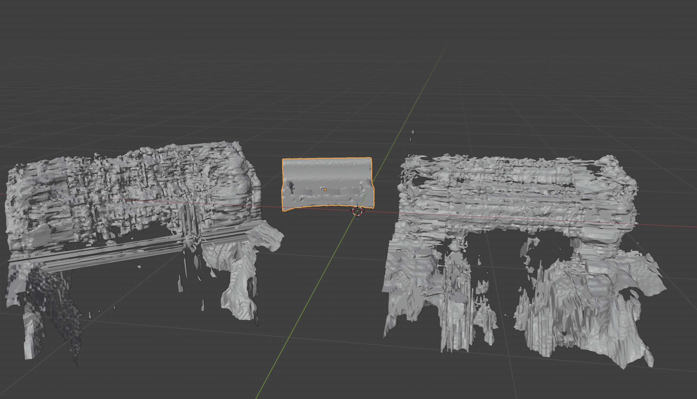
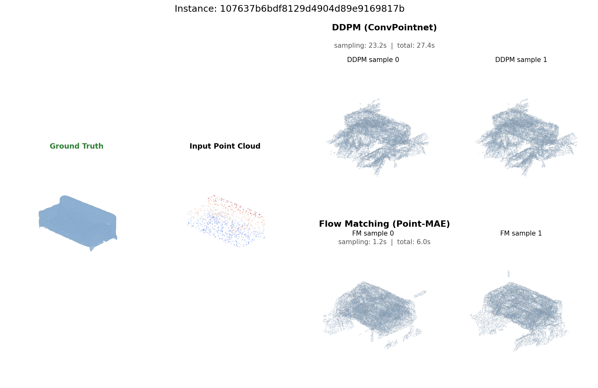
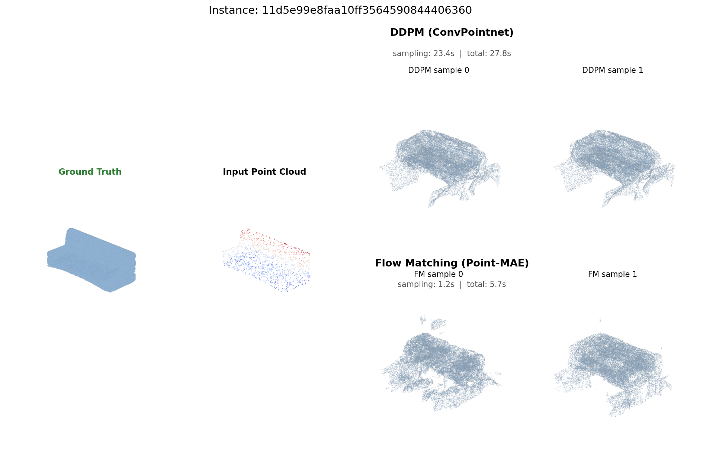
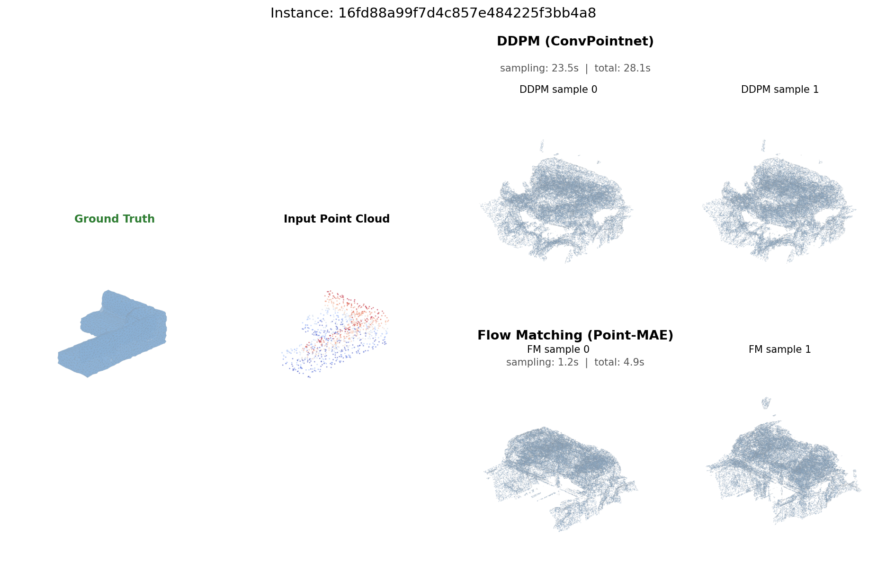

# Probabilistic SDF Generation with Flow Matching: Progress Report

**Authors:** Viswa Subramanian, Yao-Ting Huang, Minh Bao Quach

---

## 1. Introduction

This report documents the implementation progress and preliminary results for our proposed improvements to Diffusion-SDF [1], as outlined in our midterm report. The two primary contributions under investigation are:

1. **Replacing DDPM with Conditional Flow Matching (CFM)** for faster inference
2. **Replacing ConvPointnet with Point-MAE** for richer conditioning features

Both modifications have been fully implemented, unit-tested, and evaluated in a "pipeclean" training run on the ACRONYM/ShapeNet Couch dataset (173 instances). This report presents the architecture changes, training results, inference speed benchmarks, and qualitative mesh comparisons.

---

## 2. Implementation Summary

### 2.1 Flow Matching Integration

As proposed in Section 4.3 of the midterm report, we replaced the DDPM forward process and loss with the Conditional Flow Matching (CFM) objective. The key changes:

- **Training:** Instead of the DDPM noise schedule over T=1000 discrete timesteps, Flow Matching samples a continuous time t ~ U(0,1) and learns a velocity field v_θ along the linear interpolation path ψ_t(z|z₁) = (1-t)ε + t·z₁. The loss is a simple MSE between predicted and target velocities: L_CFM = ||v_θ(ψ_t, t) - (z₁ - ε)||².

- **Inference:** An ODE solver (Euler or midpoint) integrates the learned velocity field from t=0 to t=1 in a configurable number of steps (default: 50). This replaces the 1000-step ancestral sampling of DDPM.

- **Classifier-free guidance:** Adapted to the Flow Matching framework with the same 80% conditioning dropout used in the original DDPM implementation.

- **Architecture:** The underlying DiffusionNet (6-block causal transformer with cross-attention) is shared between both methods, with continuous time embedding replacing the discrete timestep embedding for Flow Matching.

The implementation is a drop-in replacement: `FlowMatchingModel` in `models/flow_matching.py` matches the `DiffusionModel` API, and a config flag `"generative_model": "flow_matching"` selects between them.

### 2.2 Point-MAE Conditioning Encoder

As proposed in Section 4.4 of the midterm report, we replaced the ConvPointnet conditioning encoder with a Point-MAE transformer encoder for the diffusion conditioning pathway. Key details:

- **Architecture:** Point-MAE groups the input point cloud into 64 patches of 32 points each using Farthest Point Sampling (FPS) and K-Nearest Neighbors (KNN), embeds each patch via a mini-PointNet, and processes them through 12 transformer blocks with positional encoding.

- **Pure PyTorch:** FPS and KNN are implemented in pure PyTorch (no PointNet2 CUDA kernels), ensuring portability and easier debugging.

- **Scope:** Point-MAE replaces ConvPointnet only in the diffusion conditioning path (Stage 2/3). The SDF-VAE module (Stage 1) retains the original ConvPointnet, as it is responsible for the plane feature extraction that defines the latent space shared by both methods.

---

## 3. Experimental Setup

### 3.1 Dataset

We used 173 couch instances from the ACRONYM/ShapeNet dataset. Each instance was preprocessed into:
- `sdf_data.csv`: Near-surface SDF samples + exact surface points (SDF=0) for point cloud extraction
- `grid_gt.csv`: Uniform grid SDF samples for end-to-end training (Stage 3)

### 3.2 Training Configuration (Pipeclean)

To validate the full pipeline end-to-end, we ran a "pipeclean" training with reduced epoch counts (1% of planned overnight run):

| Phase | Description | Epochs | Duration |
|-------|-------------|--------|----------|
| Stage 1 | SDF-VAE (shared) | 10,500 (pre-trained) | — |
| Modulation Extraction | Extract latent vectors | — | 40s |
| Stage 2 DDPM | Diffusion-only training | 200 | 5m 50s |
| Stage 2 FM | Flow Matching training | 200 | 7m 3s |
| Stage 3 DDPM | End-to-end fine-tuning | 50 | 10m 17s |
| Stage 3 FM | End-to-end fine-tuning | 50 | 10m 25s |
| **Total** | | | **~35 min** |

Stage 1 was shared between both methods — the same SDF-VAE and extracted modulations were used for both DDPM and Flow Matching training.

### 3.3 Training Configuration (Extended)

Following the pipeclean, we ran an extended training at 25-30x the pipeclean epochs:

| Phase | Description | Epochs | Duration |
|-------|-------------|--------|----------|
| Stage 1 | SDF-VAE (shared) | 10,500 (pre-trained) | — |
| Modulation Extraction | Reused from pipeclean | — | skipped |
| Stage 2 DDPM | Diffusion-only training | 5,000 | 2h 9m |
| Stage 2 FM | Flow Matching training | 5,000 | 2h 35m |
| Stage 3 DDPM | End-to-end fine-tuning | 1,500 | 4h 29m |
| Stage 3 FM | End-to-end fine-tuning | 1,500 | 4h 36m |
| **Total** | | | **~13h 48m** |

All training was performed on a single NVIDIA RTX A6000 GPU with batch size 32 and 8 data-loading workers.

### 3.4 Model Sizes

| Model | Parameters | Size |
|-------|-----------|------|
| Stage 2 DDPM (ConvPointnet) | 60.3M | 241 MB |
| Stage 2 FM (Point-MAE) | 79.8M | 319 MB |
| Stage 3 DDPM (full) | 130M | 522 MB |
| Stage 3 FM (full) | 149M | 600 MB |

The FM model is ~15% larger due to Point-MAE's transformer encoder (12 layers, 384-dim) vs ConvPointnet's convolutional architecture.

---

## 4. Results

### 4.1 Training Loss Convergence

Both methods show clear loss reduction during the pipeclean training:

| Phase | Loss (start → end) |
|-------|---------------------|
| Stage 2 DDPM | 0.514 → 0.190 |
| Stage 2 FM | 1.510 → 1.190 |
| Stage 3 DDPM | 0.299 → 0.085 |
| Stage 3 FM | 1.280 → 1.090 |

**Important note:** DDPM and FM losses are **not directly comparable** because they optimize fundamentally different objectives — DDPM predicts clean data from noisy input (L2 in data space), while FM predicts a velocity field (L2 in velocity space). However, several observations can be made:

- Both methods show healthy convergence (losses decrease monotonically)
- The SDF and generated-SDF loss components in Stage 3 are comparable between methods (sdf: 0.012 vs 0.012, gensdf: 0.066 vs 0.061), confirming that the SDF reconstruction path works correctly for both
- The FM diffusion loss (1.0) is higher than DDPM (0.004) in absolute terms, but this reflects the different loss scales, not quality

### 4.2 Inference Speed

#### What are "steps" and why do they matter?

Both DDPM and Flow Matching share the same core operation at inference time: they start from pure Gaussian noise and iteratively transform it into a meaningful latent vector by repeatedly passing it through the denoising transformer network. Each pass through the network is one "step," and each step has approximately the same computational cost (~23ms on our GPU). The total inference time is therefore roughly **steps × per-step cost**, making the step count the dominant factor in generation speed.

Where the methods differ is in *how many steps they need* to produce a usable output and *what each step computes*:

**DDPM (Denoising Diffusion Probabilistic Models)** defines a fixed forward process that gradually adds Gaussian noise to the data over T=1000 discrete timesteps. At inference, the model reverses this process: starting from pure noise z_T, it predicts and removes a small amount of noise at each step to recover z_{T-1}, then z_{T-2}, and so on down to z_0. Each step corresponds to one specific noise level in the predefined schedule, and the Markov chain structure means every step depends on the previous one. The model *must* traverse all 1000 timesteps in sequence — skipping steps breaks the statistical assumptions of the reverse process, producing degraded or incoherent outputs. This is why DDPM is fundamentally locked to 1000 network evaluations per sample.

**Flow Matching** takes a fundamentally different approach. Instead of learning to reverse a noise-adding process, it learns a *velocity field* v_θ(z, t) that describes how to transport samples from a noise distribution (t=0) to the data distribution (t=1) along straight paths. At inference, an ODE solver (Euler or midpoint) integrates this velocity field in a configurable number of steps. Unlike DDPM, there is no fixed schedule to respect — the number of steps is a free parameter chosen at inference time. Fewer steps means a coarser approximation of the ODE trajectory, but because Flow Matching learns nearly straight paths (unlike DDPM's curved noise-removal trajectories), even 20-50 steps typically suffice. Each step is a single forward pass through the same transformer architecture used by DDPM, so the per-step cost is identical. The speedup is therefore directly proportional to the step-count ratio: 1000 DDPM steps / 50 FM steps ≈ 20x.

#### Measured inference times (trained models)

We measured inference speed during mesh generation from trained Stage 3 pipeclean models on an NVIDIA RTX A6000 GPU. Each method was given the same input point cloud (1024 surface points) and produced 2 mesh samples at 128³ marching cubes resolution. Timing was measured across 3 couch instances and was highly consistent:

| Method | Steps | Encoder | Sampling | Total | Sampling Speedup |
|--------|------:|---------|--------:|------:|--------:|
| DDPM | 1000 | ConvPointnet | 23.3s | 27.5s | 1.0x |
| FM Euler | 50 | Point-MAE | 1.2s | 5.5s | **19.4x** |

**What do "sampling" and "total" measure?**

- **Sampling time** is the duration of the generative process itself — the iterative denoising (DDPM, 1000 steps) or ODE integration (FM, 50 steps) that transforms noise into a latent vector. This isolates the part of the pipeline that differs between the two methods and is the fairest comparison of the generative approaches.

- **Total time** is the wall-clock time from input point cloud to saved `.ply` mesh file. After sampling produces a latent vector, both methods share identical downstream steps: VAE decoding of the latent into plane features, and marching cubes mesh extraction at 128³ resolution (~4 seconds). Because this shared cost is fixed, the end-to-end speedup (5x) is smaller than the sampling speedup (19.4x).

For robotics applications that consume the latent representation directly (e.g., for SDF queries without explicit mesh extraction), the **19.4x sampling speedup** is the operative metric. For pipelines that require an explicit mesh, the **5x end-to-end speedup** is realized, and could be improved further by reducing the marching cubes resolution.

#### Microbenchmarks (step-count scaling)

We additionally ran isolated inference timing with randomly initialized (untrained) models to characterize how speed scales with step count (`scripts/benchmark_inference.py`). Since inference speed depends only on network architecture and step count — not on learned weights — these microbenchmarks are valid for computational cost analysis, though they say nothing about output quality at each step count.

| Method | Steps | Time (s) | Speedup vs DDPM |
|--------|------:|--------:|--------:|
| DDPM | 1000 | 7.30 | 1.0x |
| FM Euler | 50 | 0.363 | 20.1x |
| FM Euler | 20 | 0.143 | 51.1x |
| FM Euler | 10 | 0.072 | 100.7x |

The FM speedup scales linearly with the step-count ratio (1000/50 ≈ 20x, 1000/20 ≈ 50x, 1000/10 ≈ 100x), confirming that each ODE step has the same per-step cost as a DDPM denoising step. All trained-model results in this report (Section 4.2 and 4.3) use 50 FM steps. The 20-step and 10-step rows are computational cost projections only — output quality at those step counts has not yet been evaluated with trained models.

### 4.3 Qualitative Results

#### Blender Rendering

The following image shows the first generated mesh for instance `107637b6bdf8129d4904d89e9169817b` rendered in Blender. Left is Flow Matching, center is Ground Truth, right is DDPM:



Both methods produce recognizable couch-like geometry after only 50 epochs of Stage 3 fine-tuning. The meshes are rough and contain artifacts — this is expected given the minimal training. The ground truth mesh (center, orange outline) is significantly smaller and smoother, illustrating the gap between the current pipeclean training and a fully converged model.

#### Automated Comparison Grids

We developed a rendering pipeline (`scripts/render_comparison.py`) that generates side-by-side comparison grids for arbitrary numbers of instances and samples. Each grid shows:

- **Ground Truth:** Original ShapeNet mesh
- **Input Point Cloud:** 1024 surface points sampled from the SDF data
- **DDPM samples:** Generated meshes using DDPM + ConvPointnet conditioning
- **FM samples:** Generated meshes using Flow Matching + Point-MAE conditioning

Inference timing is annotated directly on each comparison image.

**Instance 1:**



**Instance 2:**



**Instance 3:**



At this early stage of training (pipeclean = 1% of planned epochs), both methods produce couch-like shapes with recognizable structure but significant noise and disconnected fragments. The DDPM outputs appear slightly more coherent, which is consistent with DDPM having a lower relative diffusion loss at convergence. However, these visual differences are not meaningful at this training scale — a full overnight or multi-day training run is needed for proper quality comparison.

---

## 5. Discussion

### 5.1 Inference Speed: Primary Finding

The most definitive finding is the **19.4x sampling speedup** of Flow Matching over DDPM, measured on trained models generating real meshes from real input point clouds. DDPM requires 23.3 seconds of sampling per shape; Flow Matching requires 1.2 seconds. End-to-end (including VAE decoding and marching cubes), DDPM takes 27.5 seconds vs 5.5 seconds for FM — a 5x improvement.

This directly addresses the limitation identified in Section 3 of the midterm report: "Slow inference due to DDPM. The DDPM-based diffusion model requires T = 1000 denoising steps for generation." Microbenchmarks suggest further speedups are possible at lower step counts (50x at 20 steps, 100x at 10 steps), pending quality validation.

### 5.2 Quality Assessment: Extended Training and Diagnosis

#### Extended run (5000 S2, 1500 S3 epochs)

After the pipeclean validation, we ran an extended training at 25-30x the pipeclean epoch counts (5000 epochs for Stage 2, 1500 for Stage 3). This run completed in ~14 hours. Loss trajectories revealed a significant convergence gap:

| Phase | Loss (start → end) | Reduction |
|-------|---------------------|-----------|
| Stage 2 DDPM | 0.450 → 0.023 | 20x |
| Stage 2 FM   | 1.540 → 0.716 | 2x |
| Stage 3 DDPM gensdf | 0.029 → 0.040 | — |
| Stage 3 FM gensdf   | 0.051 → 0.053 | — |

The DDPM loss decreased 20x over 5000 Stage 2 epochs, while FM's only decreased 2x and remained high. The FM `diff100` metric actually *increased* from 1.0 to 1.22 near the end of training, indicating instability. Generated meshes confirmed this: DDPM produced recognizable couch shapes while FM outputs were noisy and structurally chaotic.

#### Root cause analysis

We identified three contributing factors:

1. **Learning rate too low for FM+Point-MAE.** Both methods were trained with `diff_lr = 1e-5`. However, FM+Point-MAE has 79.8M parameters (vs 60.3M for DDPM+ConvPointnet), with the Point-MAE transformer requiring more gradient signal to train from scratch. The velocity field objective may also have a different loss landscape than DDPM's noise prediction.

2. **No learning rate warmup.** The FM loss showed instability (oscillating `diff100`), suggesting the optimizer was taking oversized steps early in training before the Point-MAE encoder had learned useful representations.

3. **Confounded comparison.** FM and Point-MAE were changed simultaneously, making it impossible to tell whether poor convergence was due to Flow Matching, Point-MAE, or their interaction.

#### Improved training run

Based on this analysis, we configured an improved training run with:

- **5x higher learning rate** for FM: `diff_lr = 5e-5` (vs `1e-5`)
- **Linear warmup** over 500 epochs: LR ramps linearly from 0 to `5e-5`, stabilizing early training
- **FM+ConvPointnet ablation**: An additional FM variant using the original ConvPointnet encoder, isolating Point-MAE's contribution
- **5,000 Stage 3 epochs** (vs 1,500) to give the end-to-end pipeline sufficient time to converge

This produces a three-way comparison: DDPM+ConvPointnet (existing checkpoint), FM+ConvPointnet (encoder ablation), and FM+Point-MAE (full proposed method).

### 5.3 Point-MAE vs ConvPointnet

The Point-MAE encoder adds ~20M parameters compared to ConvPointnet but processes the point cloud in a single forward pass producing a fixed-size feature tensor, whereas ConvPointnet requires coordinate-based feature querying. The conditioning overhead is comparable between the two (both add ~3.3x to sampling time). The FM+ConvPointnet ablation will clarify whether Point-MAE's additional parameters help or hinder training convergence on our small 173-instance dataset.

---

## 6. Remaining Work

1. **Improved FM training run:** Execute the improved configuration (5e-5 LR, 500-epoch warmup, 5K Stage 3 epochs) for both FM+Point-MAE and FM+ConvPointnet.

2. **Quantitative evaluation:** Compute MMD-CD, MMD-EMD, Coverage, 1-NNA for unconditional generation; MMD, TMD, UHD, CONS for conditional shape completion.

3. **Step count ablation:** Evaluate FM output quality at 10, 20, 50, and 100 ODE steps to determine the minimum viable step count for acceptable quality.

4. **DINOv2 image conditioning:** Replace ResNet-18 for image-based conditioning (deferred from current implementation scope).

---

## 7. Reproducing Results

```bash
# Activate environment
conda activate diffusionsdf

# Run pipeclean training (~35 min)
bash scripts/run_pipeclean.sh 2>&1 | tee pipeclean.log

# Generate comparison renders
python scripts/render_comparison.py \
    --ddpm-ckpt config/pipeclean_s3_ddpm/last.ckpt \
    --fm-ckpt config/pipeclean_s3_fm/last.ckpt \
    --gt-dir gt_meshes \
    --num-shapes 5 --samples-per-shape 3 \
    --output renders

# Inference speed benchmark
python scripts/benchmark_inference.py --runs 5 --mem-limit 32
```

---

## References

[1] Gene Chou, Yuval Bahat, and Felix Heide. Diffusion-SDF: Conditional generative modeling of signed distance functions. arXiv:2211.13757, 2022.

[2] Jonathan Ho, Ajay Jain, and Pieter Abbeel. Denoising diffusion probabilistic models. NeurIPS, 2020.

[3] Yaron Lipman, Ricky T. Q. Chen, Heli Ben-Hamu, Maximilian Nickel, and Matthew Le. Flow matching for generative modeling. arXiv:2210.02747, 2022.

[4] Yatian Pang, Wenxiao Wang, Francis E.H. Tay, Wei Liu, Yonghong Tian, and Li Yuan. Masked Autoencoders for Point Cloud Self-supervised Learning. ECCV, 2022.
